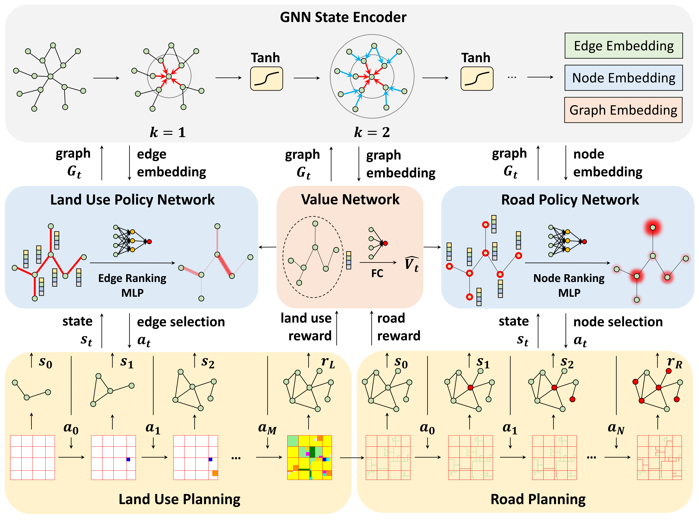

# DRL urban planning

---

This repo contains the source codes and data for our paper:

Yu Zheng, Yuming Lin, Liang Zhao, Tinghai Wu, Depeng Jin, Yong Li,  **Spatial planning of land use and roads via deep reinforcement learning**, in submission to Nature Machine Intelligence.


# Installation 

### Environment
* **Tested OS:** Linux
* Python >= 3.8
* PyTorch >= 1.8.1
### Dependencies:
1. Install [PyTorch](https://pytorch.org/get-started/previous-versions/) with the correct CUDA version.
2. Set the following environment variable to avoid problems with multiprocess trajectory sampling:
    ```
    export OMP_NUM_THREADS=1
    ```

# Training
You can train your own models using the provided config in [urban_planning/cfg/exp_cfg/real](urban_planning/cfg/exp_cfg/real).

For example, to train a model for the HLG community, run:
```
python3 -m urban_planning.train --cfg hlg --global_seed 111
```
You can replace `hlg` to `dhm` to train for the DHM community.

To train a model with planning concepts for the HLG community, run:
``` 
python3 -m urban_planning.train --cfg hlg_concept --global_seed 111
```
You can replace `hlg_concept` to `dhm_concept` to train for the DHM community.

# Visualization
You can visualize the generated spatial plans using the provided notebook in [demo](demo).

# License
Please see the [license](LICENSE) for further details.